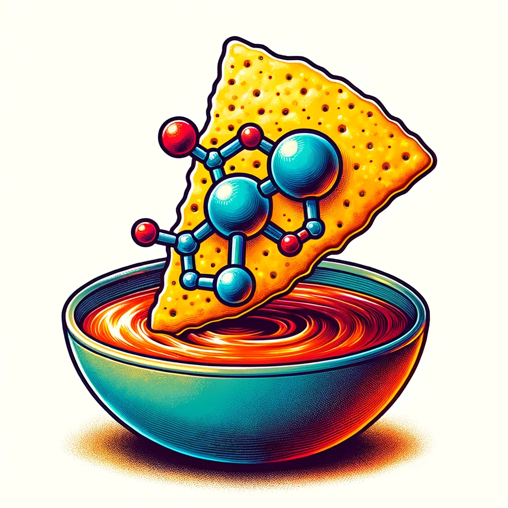

<h1 align="center">
Drug Discovery and pIC50 Prediction (DDIP)
</h1>

<br>


## Overview

DDIP (Drug Discovery and pIC50 Prediction) is a programm based in a jupyter notebook format that can predict pIC50 values for different drugs acting on a target protein (mTOR, mechanistic Target Of Rapamycin). To do so, different machine learning models (such as RandomForest, Gradient Boosting Machines (GBM) and Fully Connected Neural Network) were tested in order to have the best prediction on pIC50 values. These pIC50 values are then used to determine if a drug is bioactive on the target protein. 

## 👩‍💻 Installation

### Setup environment. 

To setup the enviromnent, you first you need to clone the repository on your local storage. 

```
git clone https://github.com/Thomas-Fischer98/PPchem_DDIP.git
```

You can create the environment. To do so, you need to go in the folder .github/workflow 
Then you can enter the following code line.

```
conda env create -f environment.yml 
```
Then you can activate the environment. 

```
conda activate myenv
```

If you need jupyter lab, install it 

```
(ppchem_ddip) $ pip install jupyterlab
```
### Install packages

To install the needed packages, you can enter the following command. 

```
pip install "git+https://github.com/Thomas-Fischer98/PPchem_DDIP.git"
```

All packages can be installed with the requirements.txt file. 

```
pip install -r requirements.txt
```

### How to use app.py

In order to use app.py, you first need to install everything as mentionned and then run the App_deplyment.ipynb file. Then you will have to run all cells in the notebook and finally a link will appear. Click on the link and it will redirect you to the app on the web. After enetering a SMILES or drawing the molecule, you can predict its bioactivity. 

### Documentation

To access documentation, go to Doc, then to docs_out, then to html and finally open index.html. 

## License

This project is licensed under the MIT license

## Authors

- Kelian Gaedecke : https://github.com/KelianGaedecke
- David Segura : https://github.com/Davidmingsegura
- Thomas Fischer : https://github.com/Thomas-Fischer98

This project was created for the class "Practical Programming in Chemistry" at EPFL.


